# 	day01 环境搭建和基础入门

今日概要：

- 搞技术的人用的文档工具（工具和语法）。
- 环境搭建，安装软件。
- 基础入门语法。


## 1.文档工具

- 学习
- 以后开发过程

文档都要用 `markdown` 语法 + 软件typora。

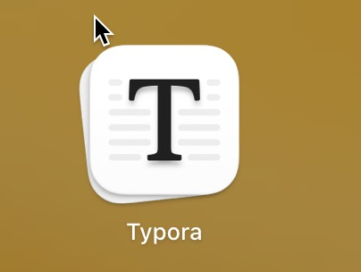


### 1.1 下载并安装typora 

https://www.typora.io/#download

- 先创建空文档
- 保存


## 2.环境搭建

- 电脑只能够识别：010101010101010010101

- Python开发者  `d:\c1.py`

  ```python
  print("hello world")
  ```

- 翻译官：Python解释器（下载安装）


想要学习Python的话，本质上就需要的做的是三个步骤：

1. 把解释器在自己电脑上安装成功。

2. 学习Python的语法并编写代码。

   ```python
   print("xxx")
   name = "xxx"
   x input("...")
   ```

3. 用  解释器  去 运行咱们写的代码。


### 2.1 安装解释器（软件）

https://python.org/

下载python并进行安装。

- 关于下载版本：https://www.python.org/downloads/（建议：3.9.0）

  ```
  其他同学如果已安装 3.6+ 也是可以的。
  ```


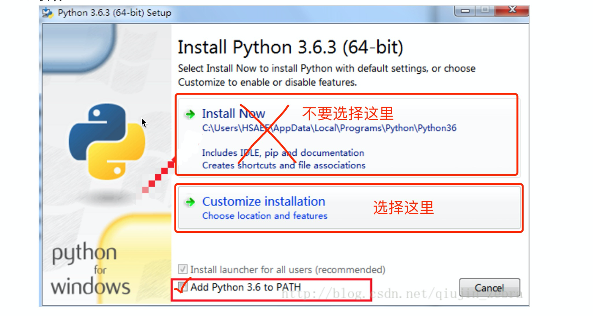

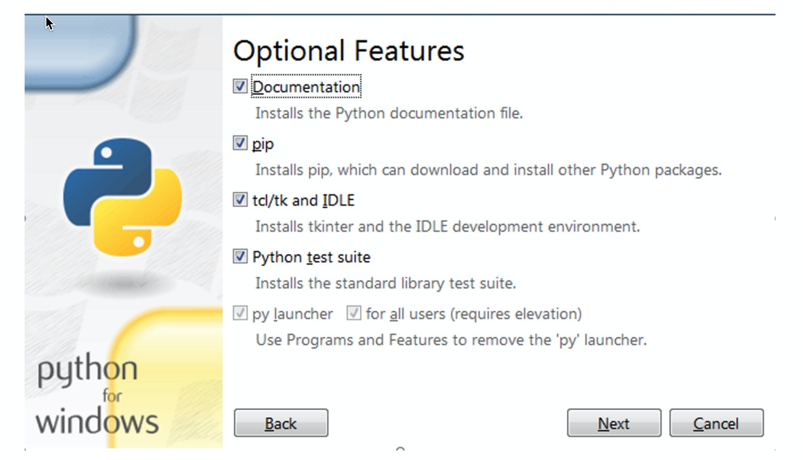


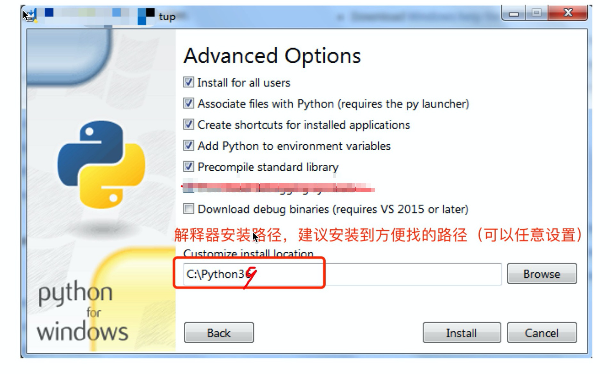

注意：不要含中文的路径。

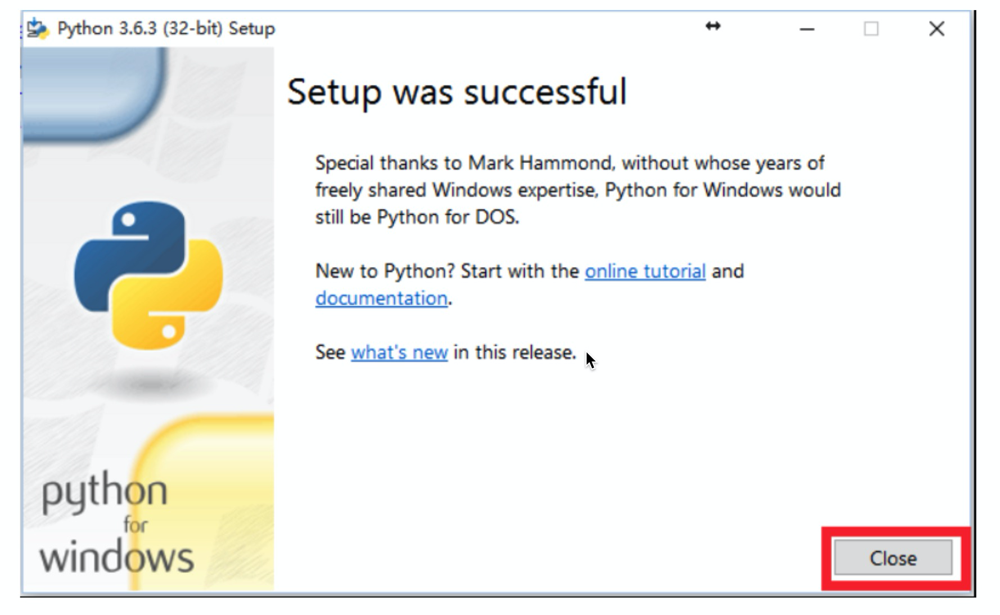


接下来的安排：

- 已成功安装Python解释器的同学
  - 下载群里的pycharm
    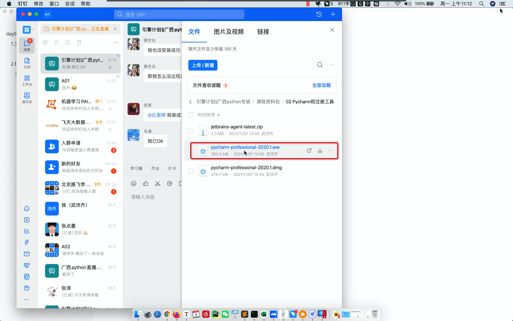
  - 安装和激活
    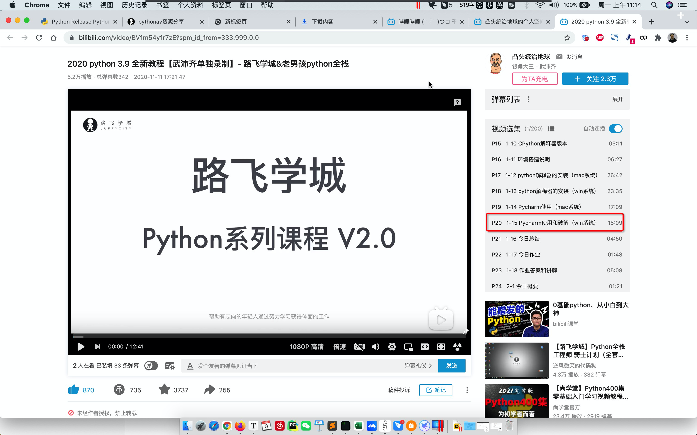


未安装成功的同学：

```
陈丽萍
孙露
秦萍
罗晓春
李曦

卢慧
庞小青
```

- 下载软件：向日葵
- 给我你的：识别码和验证码


### 2.2 安装目录

模拟你们的安装目录： `C:\Python39\`

```
C:\Python39
	- python.exe  			就是我们的解释器。
	- Scripts
		- pip.exe 			帮助我们以后安装第三方包。
	- Lib		  			Python内置的源码
		- 文件/文件夹	 	 Python提供的内置功能
		- site-packages     通过pip去安装第三方的包时，他就会放在这个目录。
```


### 2.3 Python解释器

如果想要使用Python解释器，就必须在终端上进行操作。

- 交互式，不常用。
  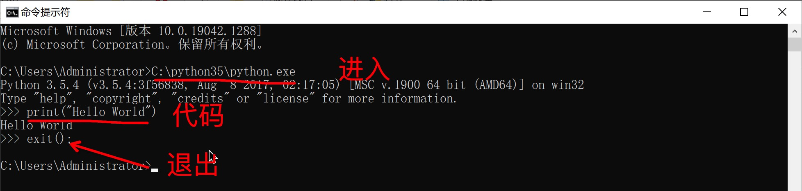

- 文件形式。

  ```
  1.假设在自己的 F:\code.py 创建了一个文件。
  2.在文件中写了点代码。
  3.运行代码
      C:\Python39\python.exe F:\code.py
  ```

  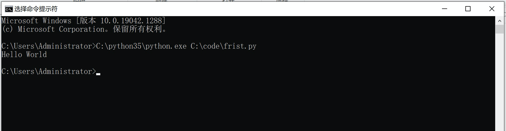


### 2.4 环境变量


```
C:\python35\python.exe  C:\code\first.py
C:\python35\python.exe  C:\code\second.py
C:\python35\python.exe  C:\code\xxx.py
```

```
C:\user\python\python37\python.exe  C:\code\xxx.py
```

如果你将一个目录放在了系统环境变量中，例如：

```
将 C:\user\python\python37 放到环境变量。
```

以后，咱们再在终端设备运行python代码时，就不需要写前面的路径了。

```
python.exe  C:\code\xxx.py
```

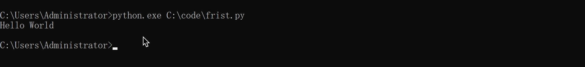


如何添加环境变量呢？

- win7

  ```
  C:\Python39\;C:\Python39\Scripts\;...
  ```

- win10
  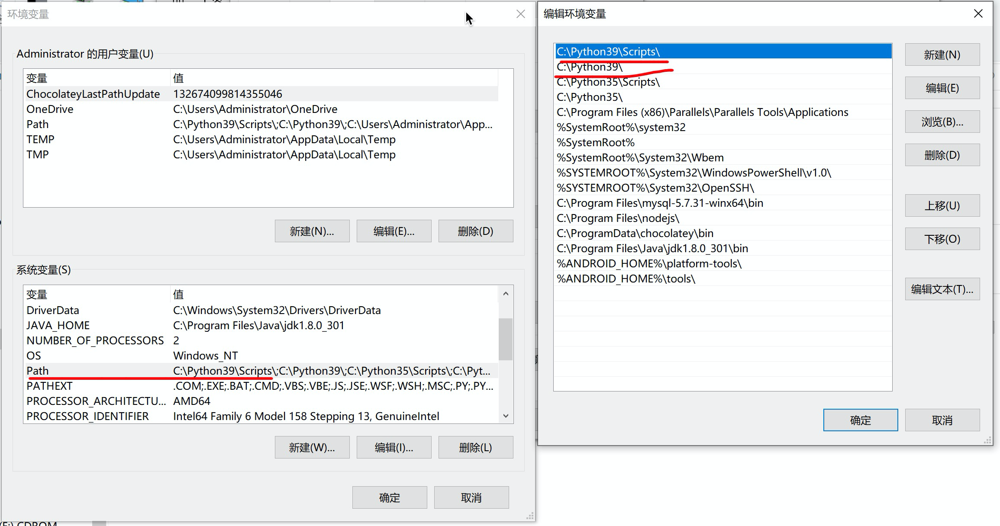


### 一起操作

- 用文本文档编写一个代码 `hello.py`

  ```python
  print("Hello World")
  ```

- 打开终端
  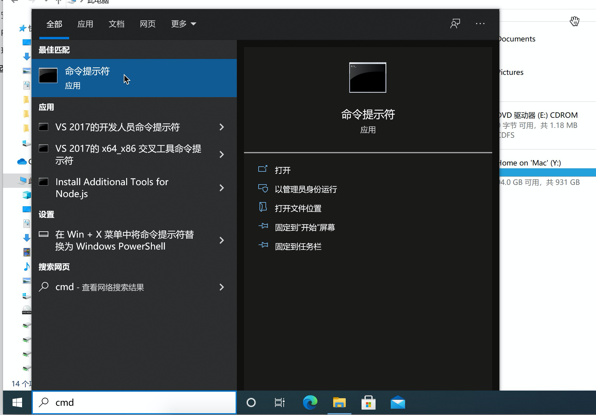

- 运行
  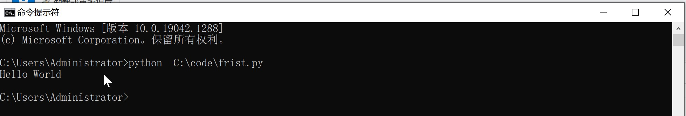


### 小结

1. Python解释器和你自己写的代码文件，不要混在同一个目录下。

   - Python解释器安装路径： `C:\python39\`
   - 自己的代码路径：`F:\code\`

2. python解释器有两种模式

   - 交互式
   - 文件式

   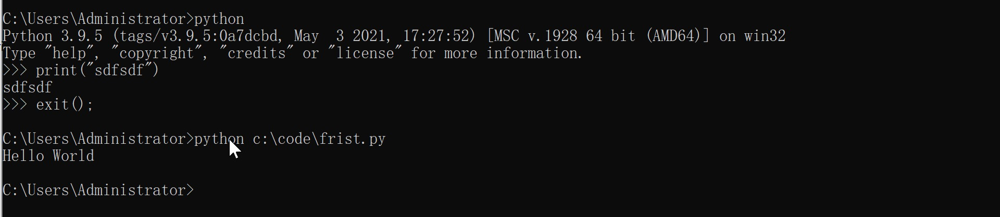

3. 运行代码时候，如果出现报错，别紧张
   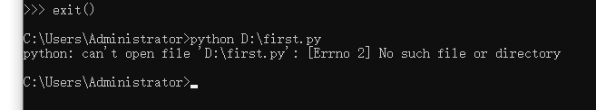


上述学习完成之后，我们以后编写代码时，就需要自己创建文件 & 终端运行代码。


一般在真正的开发过程中，都不会手动去操作。


## 3.IDE

IDE，集成开发环境（快速编写代码并运行代码）。

在Python开发中最常用的IDE就是：Pycharm 。

- 社区版，功能少【免费】。

- 专业版，功能多【收费】【试用30天】【在群文件中】

  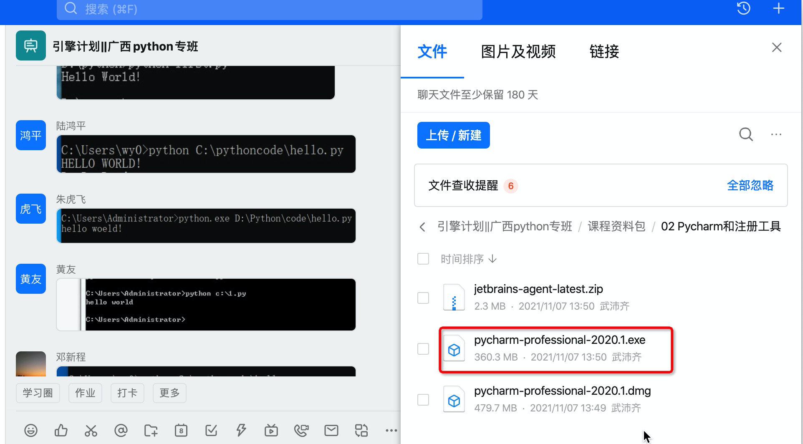

注意：不要私自安装中文插件。


### 3.1 首次打开

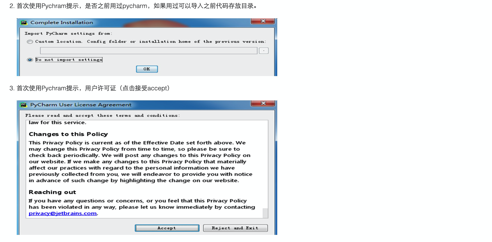

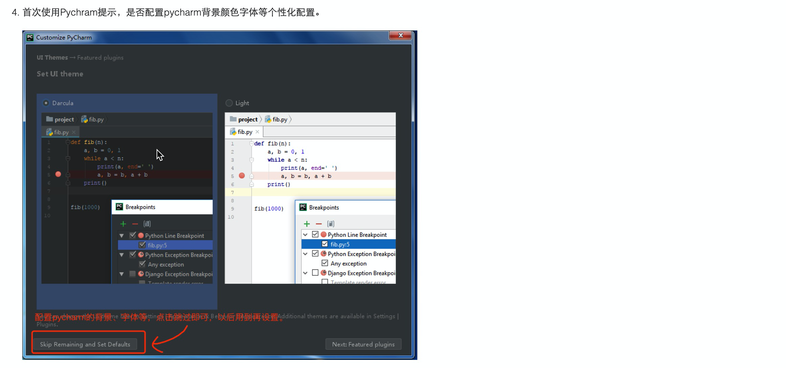

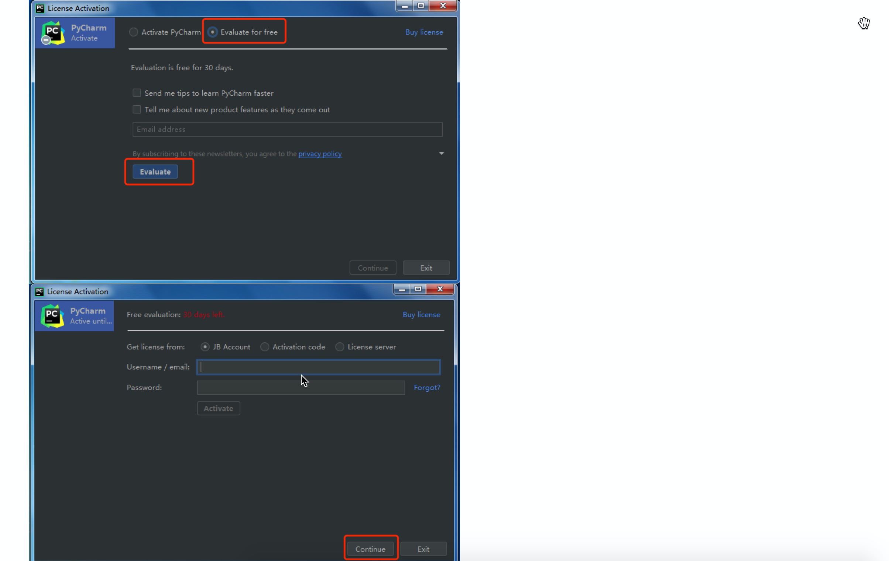


### 3.2 创建项目（文件夹）

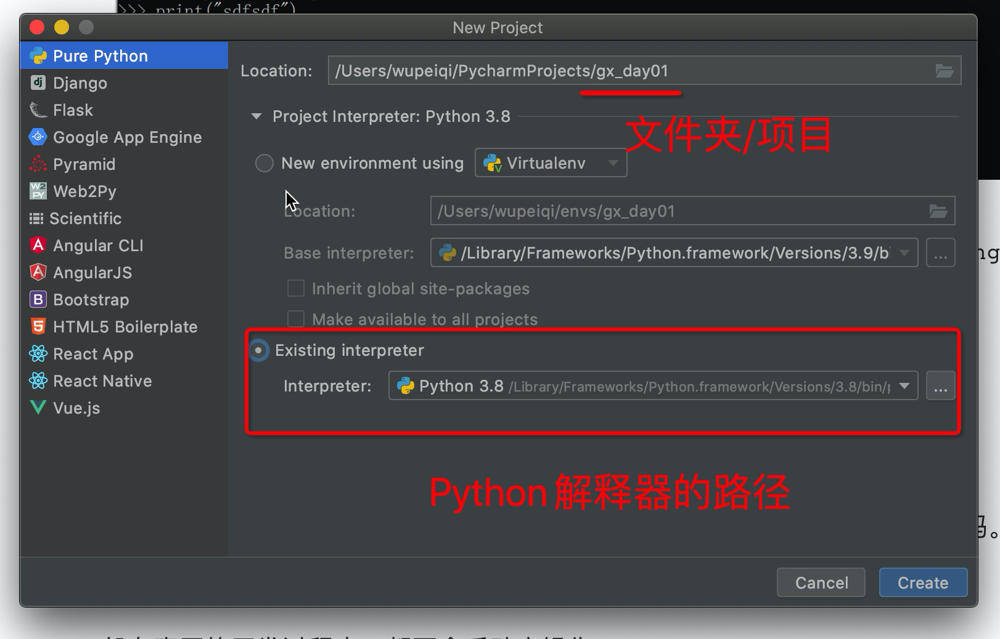

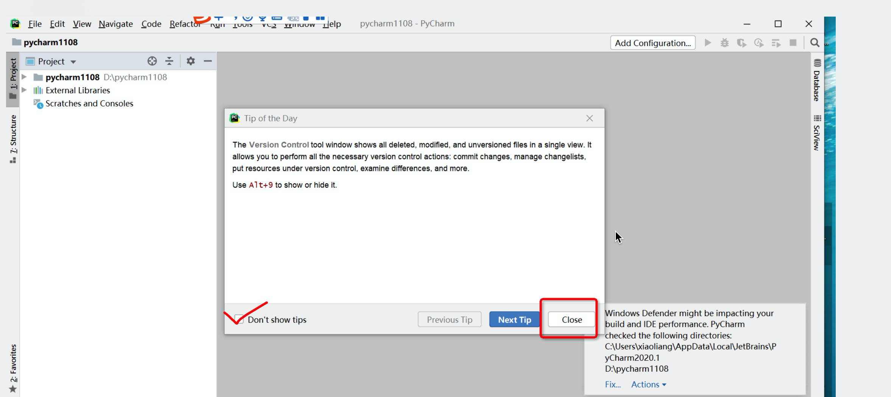


### 3.3 创建文件

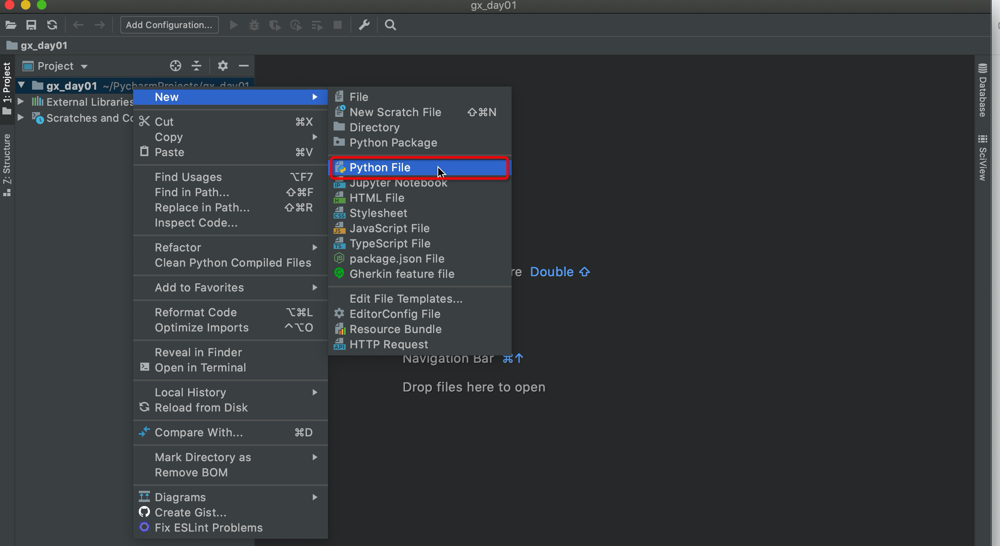

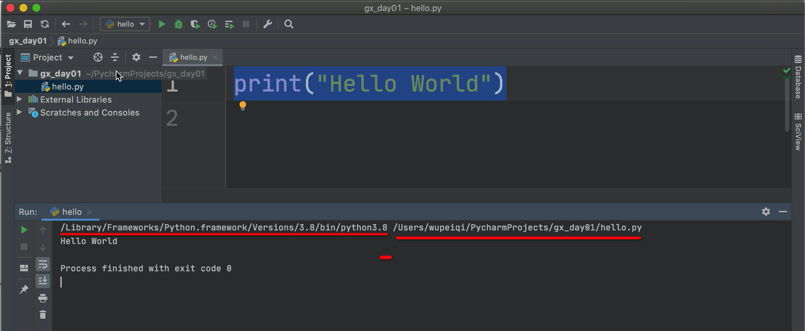


### 小结

至此，咱们成功搭建起了Python的环境。

- 解释器环境：解释器+文件  => 手动来执行代码。
- Pycharm：便捷的帮我自动  `解释器+文件` => 自动执行。

所以，为了以后提升开发效率，写代码时候都需要使用Pycharm来写代码。


## 4.Python语法


### 4.1 编码

- 工具写汉字、字母、数字，写完之后，你是需要保存到硬盘上。

  ```
  卢慧yyds666                01010101010101101010101001010101000111101
  ```

- 一套编码（密码本）UTF-8

  ```
  卢			100000011100101
  慧			111111100000001
  y			 111111110000001
  d			 111111101000001
  s			 111111100010001
  6			 111111100000101
  ```

- 用软件去打开 user.txt 

  ```python
  卢			100000011100101
  慧			111111100000001
  y			 111111110000001
  d			 111111101000001
  s			 111111100010001
  6			 111111100000101
  ```

  ```
  卢慧yyds666
  ```

在计算机中不止有一套编码（密码文）。

以后在写文件时，一定要记住自己文件保存时，用的是什么编码？以后再打开这个文件时，就需要用同样的编码去打开，否则，就会出现乱码的情况。


在Python开发过程中这种规则依然要遵循：

- 在文件中写python代码（我们以后要以utf-8编码去保存代码）。

  ```python
  print("Hello World")
  ```

- python解释器打开代码并读取文件内容，转换成计算机能够识别语言。

  ```python
  Python解释器会打开咱们的文件。
  默认：Python3.x版本解释器，默认会使用utf-8编码去打开文件。
  
  >>>C:\python39\python.exe  D:\code\first.py
  ```

  

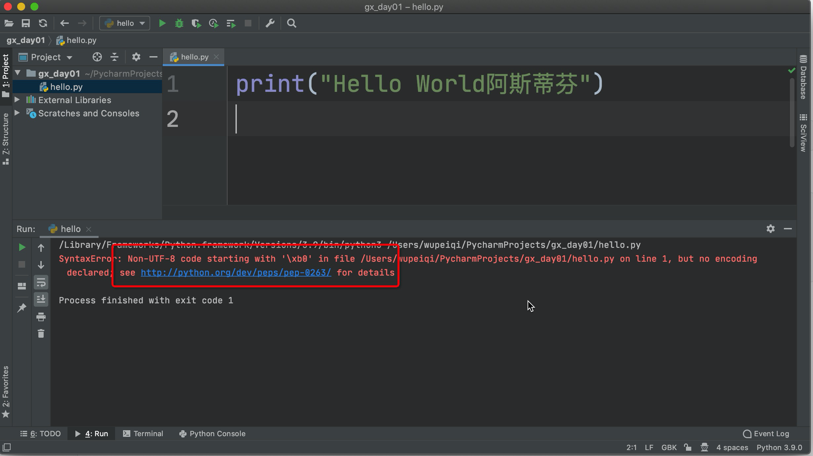


### 4.2 输出

让程序在内部帮助我们做事，做完事之后将结果输出出来。

```python
print("你好呀")
print("欢迎使用xxx系统")
```


例如：找到某个目录下所有的以为 .png 为结尾的文件。

```python
import os

for item in os.listdir("/Users/wupeiqi/PycharmProjects/gx_day01"):
    if item.endswith('png'):
        print(item)
```


- 输出的基本用法

  ```python
  print("郭德纲")
  ```

- 不要换行

  ```python
  print("伤情最是晚凉天", end="")
  print("憔悴私人不堪言", end="")
  ```


### 4.3 数据类型

什么是数据类型？学了他有什么用？

- 字母、数字、汉字、成语、文言文； 基于这些知识写文件/作文  --> 老师批改。【学中文经验】
- 本文、数字、真假。。。               ； 基于数据类型写代码文件   --> 计算运行。 【学编程语言】


#### 4.3.1 整型（int）

表示我们生活中的数字，例如：19、180、150。

```python
19
20
300
```

```python
300 + 19
2 * 6
80 - 77
100 / 10
98 % 10
```

```python
print(19)
print(300 + 19 )
```


#### 4.3.2 字符串（str）

用来表示我们生活中的本文信息，例如："李国良"     "中国北京昌平区" 

```python
# 单行文本
"毛谦"
'李国良'

# 多行文本
"""陈丽萍"""
'''梁吉宁'''
```

```python
print("毛谦")
print('毛谦')
```


字符串之间可以进行相加，就是字符串拼接。

```python
"李国良" + "yyds"
"李国良yyds"
```


字符串和数字相乘，等到的就是让字符串重复多少次。

```python
"毛谦" * 3
"毛谦毛谦毛谦"
```


#### 练习题

```python
print( 12 + 12 ) 
# 24，整型
```

```python
print( "12" + "12" ) 
# "1212"，字符串（文本）
```


#### 转换

```python
str(19)       # 19    ->     "19"
int("88")     # "88"  ->     88

int("广西联通")  # 无法转换，报错
```


#### 练习题

1. 计算整型50乘以10再除以5的商并使用print输出。

   ```python
   print(  50 * 10 / 5  )
   ```

2. 计算整型30除以2得到的余数并使用print输出。

   ```
   print(  30 % 2  )
   ```

3. 使用字符串乘法实现 把字符串”我爱我的祖国”创建三遍并拼接起来最终使用print输出。

   ```
   print(   3 * "我爱我的祖国"  )
   ```

4. 看代码写结果（禁止运行代码）：

   ```python
   print( int("100")*3 )
   print( int("123") + int("88") )
   print( str(111) + str(222) )
   print( str(111)*3  )
   ```


#### 4.3.3 布尔类型（bool）

- 真 True
- 假 False

```python
1  >  2     			-> False
1  ==  2				-> False
"梁吉宁" == "陈青"		 -> False
22 == 22 				-> True
```


整型、字符串类型 -> 布尔值。

- 整型， 0转换为布尔值为False，其他均为True

  ```python
  print(  bool(0)  )   # False
  print(  bool(-1)  )  # True
  print(  bool(100)  ) # True
  ```

-  字符串，空字符串转换为布尔值为False，其他均为True

  ```python
  print(  bool("")  )  # False
  print(  bool("s")  )  # True
  print(  bool(" ")  )  # True
  ```


#### 练习题

```python
print( int("8") > 7 ) 
print( str(111) == 111 )
print( bool(-1) )
print( bool(0) )
print( bool("") )
print( bool("你好") )
print( True == True )
print( True == False )
print( bool("") == bool(0) )
```


### 4.4 变量

变量，就是我们给某个值取名称/外号。

格式：`变量名 = 值`

```python
addr = "中国北京市昌平区沙河镇xxx校区1号楼3单元909"

print(addr)
print(addr)
print(addr)
print(addr)
```

```python
age = 18
name = "邓新成"
is_success = 1 > 19  # False

addr = "中国北京" + "沙河"

address = "中国北京" + "海淀区" + name   # "中国北京海淀区邓新成"
```

```python
result = 1 == 2  # False

print(result)
```


#### 4.4.1 规范

```python
name = "吴国凤"
```

- 变量名中只能包含：字母、数字、下划线。

- 不能以数字开头

- 不能使用Python内置的关键字

  ```
  [‘and’, ‘as’, ‘assert’, ‘break’, ‘class’, ‘continue’, ‘def’, ‘del’, ‘elif’, ‘else’, ‘except’, ‘exec’, ‘finally’, ‘for’, ‘from’, ‘global’, ‘if’, ‘import’, ‘in’, ‘is’, ‘lambda’, ‘not’, ‘or’, ‘pass’, ‘print’, ‘raise’, ‘return’, ‘try’, ‘while’, ‘with’, ‘yield’]
  ```


#### 练习题

```python
1 name = "吉诺比利"
2 name0 = "帕克"
3 name_1 = "邓肯"
4 _coach = "波波维奇"
5 _ = "卡哇伊"
6 1_year = "1990"
7 year_1_ = "1990"
8 _1_year = "1990"
9 nba-team = "马刺" 
10 new*name = "伦纳德"
```


#### 4.4.2 变量的内存指向

通过学习上述变量知识让我们对变量了有了初步认识，接下来我们就要从稍稍高级一些的角度来学习变量，即：内存指向（在电脑的内存中是怎么存储的）。

**情景一**

```python
name = "wupeiqi"
```

在计算机的内存中创建一块区域保存字符串”wupeiqi”，name变量名则指向这块区域。

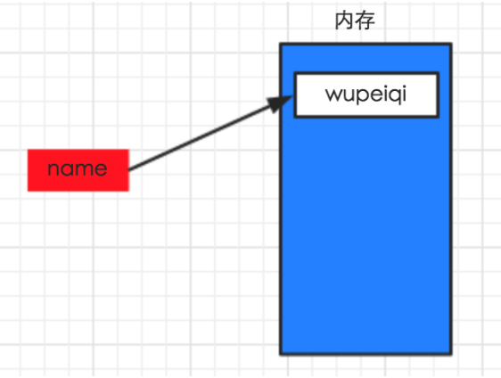

**情景二**

```python
name = "wupeiqi"
name = "Alex"
```

在计算机的内存中创建一块区域保存字符串”wupeiqi”，name变量名则指向这块区域。然后又再内存中创建了一块域保存字符串”alex”，name变量名则指向”alex”所在的区域，不再指向”wupeiqi”所在区域（无人指向的数据会被标记为垃圾，由解释器自动化回收）

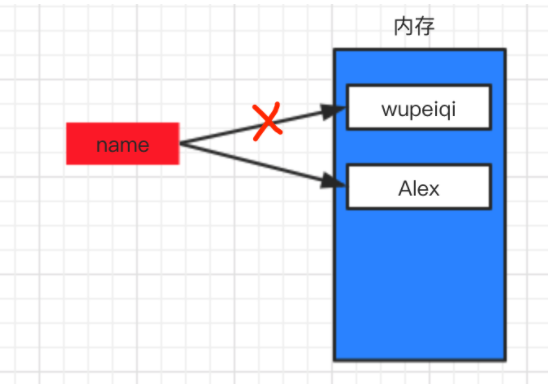


**情景三**

```python
name = "wupeiqi"
new_name = name


```

在计算机的内存中创建一块区域保存字符串”wupeiqi”，name变量名则指向这块区域。new_name变量名指向name变量，因为被指向的是变量名，所以自动会转指向到name变量代表的内存区域。

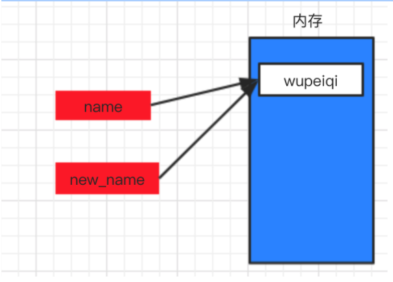

**情景四**

```python
name = "wupeiqi"
new_name = name
name = "alex"
```

在计算机的内存中创建一块区域保存字符串”wupeiqi”，name变量名则指向这块区域(灰色线)， 然后new_name指向name所指向的内存区域，最后又创建了一块区域存放”alex”，让name变量指向”alex”所在区域.

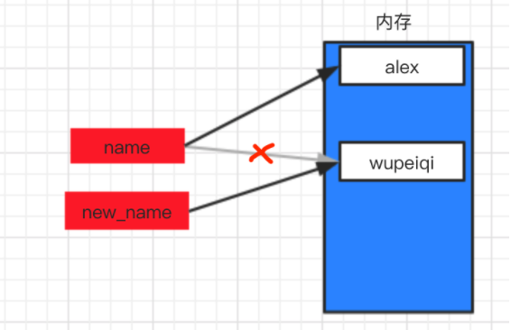


**情景五**

```python
num = 18
age = str(num)
```

在计算机的内存中创建一块区域保存整型18，name变量名则指向这块区域。通过类型转换依据整型18再在内存中创建一个字符串”18”, age变量指向保存这个字符串的内存区域。

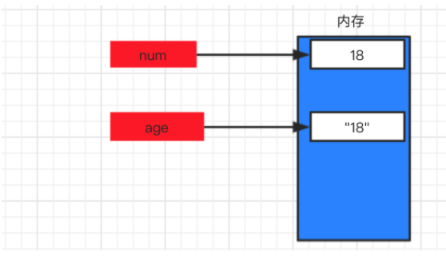


至此，关于变量的内存相关的说明已讲完，由于大家都是初学者，关于变量的内存管理目前只需了解以上知识点即可，更多关于内存管理、垃圾回收、驻留机制等问题在后面的课程中会讲解。


#### 练习题

1. 看代码写结果

   ```python
   alex_length = 3
   wupeiqi_length = 18
   total = alex_length + wupeiqi_length
   
   print(total) # 21
   ```

2. 看代码写结果

   ```python
   nickname = "一米八大高个"
   username = nickname
   
   username = "弟弟"
   
   print(nickname) #  "一米八大高个"
   print(username) # "弟弟"
   ```

   ```python
   nickname = "一米八大高个"
   username = nickname
   nickname = "弟弟"
   
   print(nickname) # "弟弟"
   print(username) # "一米八大高个"
   ```

   ```python
   nickname = "一米八大高个"
   username = nickname
   nickname = "弟弟"
   text = username + nickname
   
   print(text) # "一米八大高个弟弟"
   ```

3. 看代码写结果

   ```python
   string_number = "20"
   num = int(string_number)
   
   data = string_number * 3
   print(data) # "202020"
   
   value = num * 3
   print(value) # 60
   ```

   

### 4.5 注释

让Python解释器看到之后，自动忽略的代码。

- 单行注释

  ```python
  # 注释内容
  
  快捷键：
  	- win：control + ?
      - mac：commond + ？
  ```

- 多行注释

  ```python
  """
  注释的内容
  ...
  ..
  """
  ```

  


### 4.6 输入

为什么要有输入呢？

```python
text = input("提示信息")
print(text)
```

```python
name = input("请输入姓名:")
age = input("请输入年龄:")
email = input("请输入邮箱:")

text = name + age + email
print(text)
```

```python
name = input("请输入姓名:")
age = input("请输入年龄:")
email = input("请输入邮箱:")

text = "我叫" + name + "，今年" + age + "岁，我的邮箱是" + email + "。"
print(text)
```

```python
v1 = input("请输入数字:")  # "100"
v2 = input("请输入数字:")  # "200"

result = v1 + v2
print(result)  # "100200"
```

```python
v1 = input("请输入数字:")  # "100"
v2 = input("请输入数字:")  # "200"

result = int(v1) + int(v2)
print(result)  # 300
```


### 4.7 条件语句

在生活经常会说，如果xx就xx。

```python
if 条件/真假  :
	条件成立后会执行此处的代码
	条件成立后会执行此处的代码
    条件成立后会执行此处的代码
    条件成立后会执行此处的代码
    条件成立后会执行此处的代码
else:
    不成立，走此处的代码
    不成立，走此处的代码
    不成立，走此处的代码
    不成立，走此处的代码
```

```python
if 条件{
    ...
}else{
    ...
}
```

案例：

```python
print("开始")
if True:
    print("111")
    print("222")
else:
    print("666")
    print("999")
    
print("结束")
```

```python
print("开始")
if 1 > 2:
    print("111")
    print("222")
else:
    print("666")
    print("999")

print("结束")
```

```python
print("开始")
num = 9
if num > 10:
    print("111")
    print("222")
else:
    print("666")
    print("999")

print("结束")
```


```python
print("欢迎使用联通系统")

user = input("请输入用户名：")
pwd = input("请输入密码：")

if user == "wupeiqi" and pwd == "123":
    print("恭喜你")
    print("登录成功，获得奖励100w。")
else:
    print("登录失败")
    print("你错误的是一个成为百万年薪的人")

print("程序结束")
```


