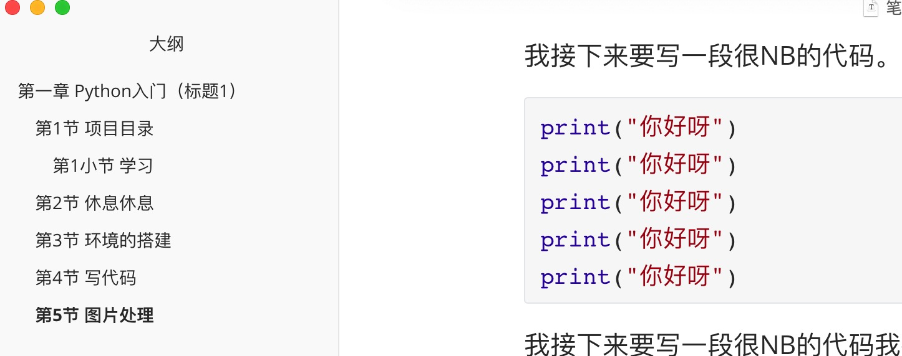
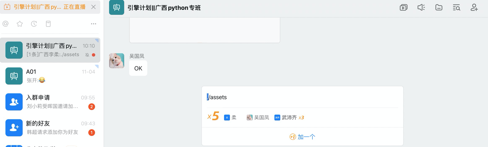

# 第一章 Python入门（标题1）

今日咱们要学python的很作知识.....


## 第1节 项目目录

今日咱们要学python的很作知识.....


### 第1小节 学习


今日咱们要学python的很作知识.....


## 第2节 休息休息


## 第3节 环境的搭建

如果想要进行环境的搭建，大家必须要做以下几个步骤：

- 下载
- 安装
  - 找到我的目录
  - 水电费水电费
    - 水电费
      - 发方法
  - 点击安装按钮
    - 方法
  - 电饭锅
- 卸载

- 学习
- xx谢新雪
- 谢新雪
- 发方法
- 方法

电饭锅阿斯顿发士大夫阿斯蒂芬

1. 方法
   1. 啥的
   2. 水电费
   3. 水电费
2. 飞瓜
   - 方法
   - 水电费
   - 水电费
3. 搜索


## 第4节 写代码

我接下来要写一段很NB的代码。

```python
print("你好呀")
print("你好呀")
print("你好呀")
print("你好呀")
print("你好呀")
```

我接下来要写一段很NB的代码我接下来 `print("你好呀")` 要写一段很NB的代码我接下来要写一段很NB的代码我接下来要写一段很NB的代码我接下来要写一段很NB的代码我接下来要写一段很NB的代码我接下来要写一段很NB的代码我接下来要写一段很NB的代码我接下来要写一段很NB的代码


## 第5节 图片处理

我接下来要写一段很NB的代码我接。



我接下来要写一段很NB的代码我接。

设置：设置图片只要粘贴到笔记中，自动将图片放到某个指定的目录（当前文件所在的目录）。





## 第6节 引用

发斯蒂芬骄傲；山东矿机发

> 大师法师打发斯蒂芬阿斯蒂芬阿斯蒂芬阿斯蒂芬阿斯蒂芬阿斯蒂芬阿斯蒂芬
>
> 阿斯蒂芬阿斯蒂芬阿斯蒂芬
>
> 阿斯蒂芬阿萨德发短发

阿斯顿发士大夫

> asdf asdfas
>
> asdfasdf
>
> asdf 
>
> asdf asd


回顾：

- 标题 #空格
- 列表 - 空格   1.空格     tab     shift+tab
- 代码    ```  

- 图片
- 引用


### 发送到

```
as阿斯顿发士大夫
```


