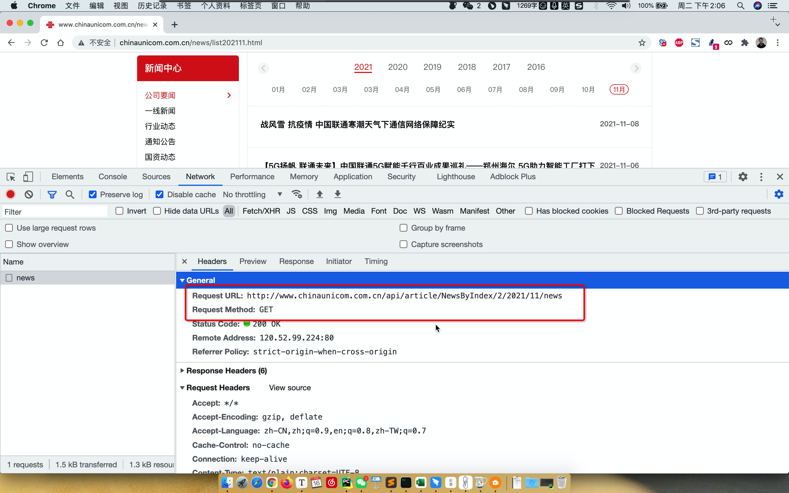
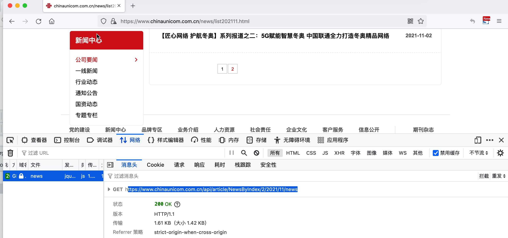
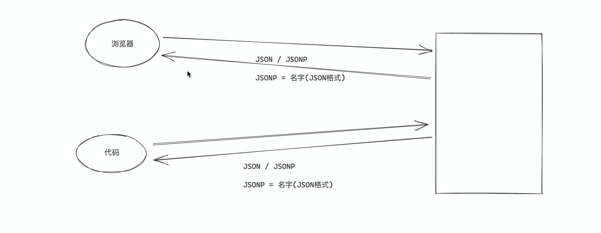
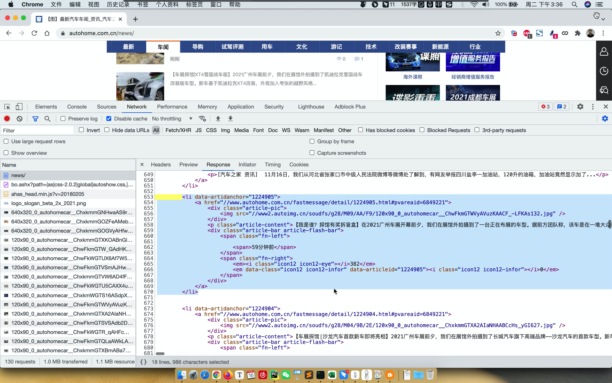
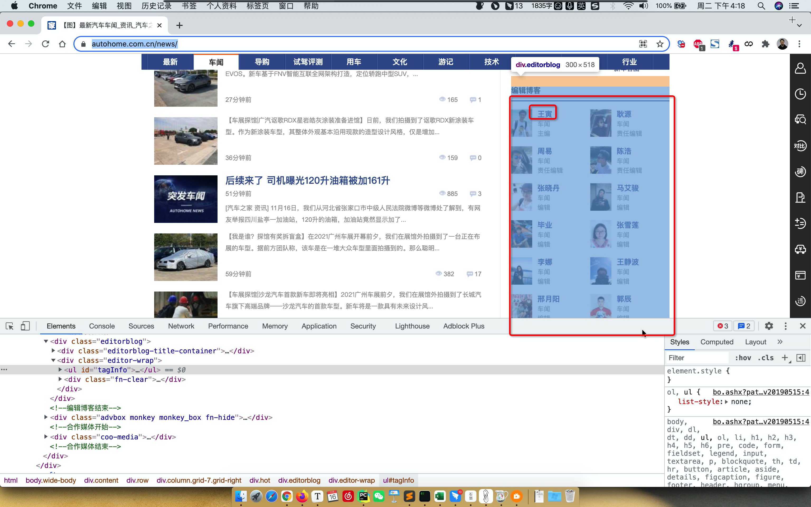
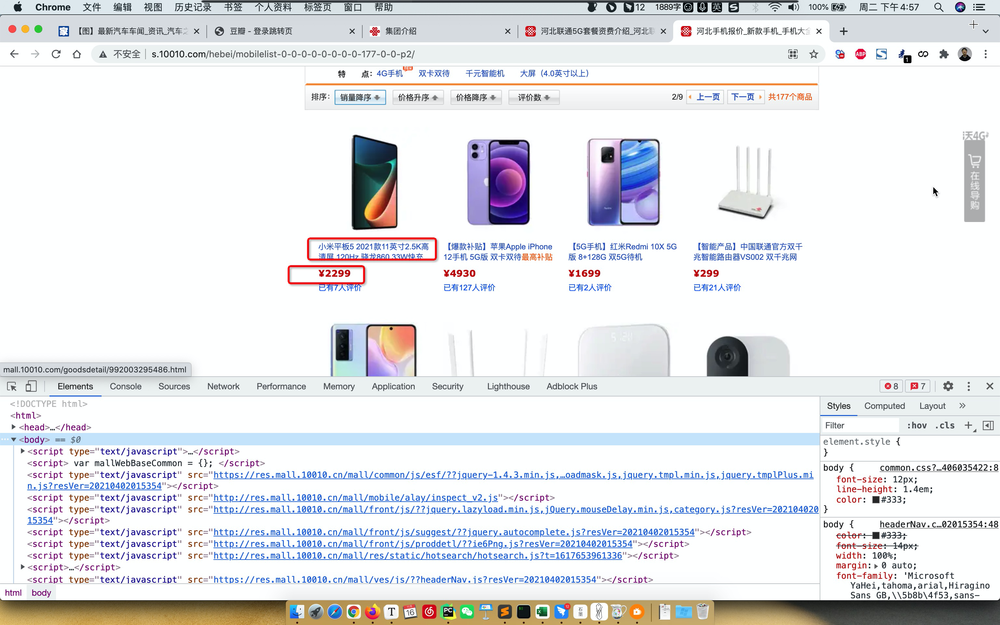

# day08 模块和面向对象

今日概要：

- 模块
  - 自定义模块（已讲）
  - 内置模块
    - shutil
    - re（正则表达式）
  - 第三方模块
    - requests 模块
    - bs4 模块
- 面向对象，看懂别人的代码（我们编程用函数式）。


## 1. 模块


### 1.1 自定义模块

- py文件或文件夹
- from 、import
- sys.path【你运行的当前脚本 + 系统内置目录】
- 自己的模块名不要和内置模块名重名。


#### 补充：主文件

```python
def run():
    print(123)


# 当你在运行当前脚本时，__name__ 是Python内部会创建一个变量 __name__ = "__main__"
# 如果当前的脚本，是被别人导入执行的，Python在这个脚本的内部会创建 __name__ = "app"
if __name__ == '__main__':
    run()
```

注意：标志；防止别人导入就执行程序，只有主动执行才可以。


### 1.2 内置模块

```
os/random/hashlib/json/time/datetime
```


#### 1.2.1 shutil

- 删除文件夹

  ```python
  import shutil
  
  shutil.rmtree("xx/xxx/xxx/xxx")
  ```

- 拷贝文件夹

  ```python
  shutil.copytree("原文件夹","目标文件夹路径")
  ```

- 拷贝文件

  ```python
  # 拷贝源文件到文件夹（保证文件夹存在）
  shutil.copy("原文件夹","目标文件夹路径/")
  ```

- 重命名

  ```python
  import shutil
  
  # 文件重命名
  # shutil.move("x10", 'x10.txt')
  
  # 文件件重命名
  # shutil.move("x1", 'x100')
  
  ```

  ```python
  import os
  import shutil
  
  if os.path.exists("x10"):
      shutil.move("x10", 'x10.txt')
  
  if os.path.exists("x1"):
      shutil.move("x1", 'x100')
  ```

- 压缩和解压缩

  ```python
  import shutil
  
  # base_name，压缩包的文件名
  # format，后缀名
  # root_dir，压缩的文件夹的路径
  shutil.make_archive(base_name='1116', format='zip', root_dir="ppp")
  
  
  # filename，压缩包的文件名
  # extract_dir，要解压的目录
  # format，后缀名
  shutil.unpack_archive(filename="1116.zip", extract_dir="1117", format='zip')
  ```


练习题：

```
day01 
	01 fullstack s7 day01 xxxxxx.mp4
	02 fullstack s7 day01 xxxxxx.mp4
	03 fullstack s7 day01 xxxxxx.mp4
	04 fullstack s7 day01 xxxxxx.mp4
	xxxx.md
```

寻找day01目录下的所有mp4为后缀的文件，给重命名：

```
01 fullstack s7 day01 xxxxxx.mp4    ->  01 xxxxxx.mp4
```

```python
import os
import shutil

folder_path = "/Users/wupeiqi/PycharmProjects/gx_day08/day01"

for name in os.listdir(folder_path):
    ext = name.rsplit(".", maxsplit=1)[-1]
    if ext != "mp4":
        continue

    new_name = name.replace("fullstack s7 day01 ", "")

    old_file_path = os.path.join(folder_path, name)
    new_file_path = os.path.join(folder_path, new_name)
    # 重命名
    shutil.move(old_file_path, new_file_path)
```


#### 1.2.2 re

- 正则表达式【与语言无关】
- Python中的re模块


正则表达式是干啥的？

```
text = "楼主太牛逼了，在线想要 442662578@qq.com 和 xxxxx@live.com谢谢楼主，手机号也可15131255789，搞起来呀"

需求：将字符串中的邮箱提取出来 / 手机号。
	手机号特征：1[3|5|8|9]\d{9}     -> 正则语法规定
```


```python
text = "楼主太牛逼了，在线想要 442662578@qq.com和xxxxx@live.com谢谢楼主，手机号也可15131255789，搞起来呀"

import re

data_list = re.findall("1[3|5|8|9]\d{9}", text)
print(data_list)
```

```python
import re

text = "楼主太牛逼了，在线想要 442662578@qq.com和xxxxx@live.com谢谢楼主，手机号也可15131255789，搞起来呀"
email_list = re.findall("\w+@\w+\.\w+", text, re.ASCII)
print(email_list)  # ['442662578@qq.com', 'xxxxx@live.com']
```


##### 1.字符相关

- 固定文本

  ```python
  import re
  
  text = "你好wupeiqi,阿斯顿发wupeiqasd 阿士大夫能接受的wupeiqiff"
  
  data_list = re.findall("wupeiqi", text)
  
  print(data_list) # ["wupeiqi", "wupeiqi"]
  ```

- 匹配字符

  ```python
  import re
  
  text = "你2b好wupeiqi,阿斯顿发awupeiqasd 阿士大夫a能接受的wffbbupqaceiqiff"
  data_list = re.findall("[abc]", text)
  print(data_list) # ['b', 'a', 'a', 'a', 'b', 'b', 'c']
  ```

  ```python
  import re
  
  text = "你2b好wupeiqi,阿斯顿发awupeiqasd 阿士大夫a能接受的wffbbupqcceiqiff"
  data_list = re.findall("q[abc]", text)
  print(data_list) # ['qa', 'qc']
  ```

- 字符范围 a-z   0-9

  ```python
  import re
  
  text = "alexrootrootadmin"
  data_list = re.findall("t[a-z]", text)
  print(data_list)  # ['tr', 'ta']
  ```

  ```python
  import re
  
  text = "alexrootrootadmin"
  data_list = re.findall("t[0-9]", text)
  print(data_list)  # []
  ```

- `\d`代表1个数字

  ```python
  import re
  
  text = "root-ad32min-add3-admd1in"
  data_list = re.findall("d\d", text)
  print(data_list) # ['d3', 'd3', 'd1']
  ```

  ```python
  import re
  
  text = "root-ad32min-add33322-admd1in"
  data_list = re.findall("d\d+", text)  # +，1个或n个
  print(data_list) # ['d32', 'd33322', 'd1']
  ```

  ```python
  import re
  
  text = "rodot-ad32min-add33322-admd1in"
  data_list = re.findall("d\d*", text)  # *，0个或n个
  print(data_list) # ['d', 'd32', 'd', 'd33322', 'd', 'd1']
  ```

  ```python
  import re
  
  text = "rodot-ad32min-add33322-admd1in"
  data_list = re.findall("d\d?", text)  # ?，0个或1个
  print(data_list) # ['d', 'd3', 'd', 'd3', 'd', 'd1']
  ```

  ```python
  import re
  
  text = "rodot-ad32min-add33322-admd1in"
  data_list = re.findall("d\d{2}", text)  # {n}，固定n个
  print(data_list) # ["d32","d33"]
  ```

  ```python
  import re
  
  text = "rodot-ad32min-add33322-admd1in"
  data_list = re.findall("d\d{2,}", text)  # {n,}，固定n+个
  print(data_list) # ['d32', 'd33322']
  ```

  ```python
  import re
  
  text = "rodot-ad32min-add33322-admd1in"
  data_list = re.findall("d\d{2,4}", text)  # {n,m}，固定 n<=个数 <=m
  print(data_list) # ['d32', 'd3332']
  ```

- `\w` 字母、数字、下划线（汉字）

  ```python
  import re
  
  text = "北京武沛alex齐北  京武沛alex齐"
  
  data_list = re.findall("武\w+x", text)
  print(data_list) # ['武沛alex', '武沛alex']
  ```

  ```python
  import re
  
  text = "北京武沛alex齐北京武沛alex齐"
  
  data_list = re.findall("武\w+x", text)  # 贪婪匹配（默认）（尽可能多的去匹配）
  # print(data_list)  # ['武沛alex齐北京武沛alex']
  
  
  data_list = re.findall("武\w+?x", text)  # 非贪婪匹配（找到第一个匹配，就不要再继续了）
  print(data_list)  # ['武沛alex', '武沛alex']
  ```

  问题：正则默认是贪婪匹配，如何改成非贪婪匹配：在正则中添加一个 ? 。

- `.` 除换行符以外的任意字符

  ```python
  import re
  
  text = "alexraotrootadmin"
  data_list = re.findall("r.o", text)
  print(data_list) # ['rao', 'roo']
  ```

  ```python
  import re
  
  text = "alexraotrootadmin"
  data_list = re.findall("r.+o", text) # 贪婪匹配
  print(data_list)  # ['raotroo']
  ```

  ```python
  import re
  
  text = "alexraotrootadmin"
  data_list = re.findall("r.+?o", text) # 贪婪匹配
  print(data_list)  # ['rao', 'roo']
  ```

- `\s`代表任意空白符。

  ```python
  import re
  
  text = "root admin fdd dmin"
  data_list = re.findall("a\w+\s\w+", text)
  print(data_list)  # ['admin fdd']
  ```

  

##### 2.数量

- *，0或n
- +，1或n
- ？，0或1
- {n}，固定n个
- {n,}，n+个
- {n,m}，n~m个

注意：默认贪婪匹配，非贪婪匹配 数量+? 。


##### 3.分组

- 提取数据区域

  ```python
  import re
  
  text = "楼主太牛逼了，在线想要 442662578@qq.com和xxxxx@live.com谢谢楼主，手机号也可15131255799，搞起15131255789来呀"
  data_list = re.findall("151312\d{5}", text)
  print(data_list)  # ['15131255799', '15131255789']
  ```

  ```python
  import re
  
  text = "楼主太牛逼了，在线想要 442662578@qq.com和xxxxx@live.com谢谢楼主，手机号也可15131255799，搞起15131255789来呀"
  data_list = re.findall("15131(2\d{5})", text)
  print(data_list)  # ['255799', '255789']
  ```

  ```python
  import re
  
  text = "楼主太牛逼了，在线想要 442662578@qq.com和xxxxx@live.com谢谢楼主，手机号也可15131255799，搞起15131255789来呀"
  data_list = re.findall("(1\d{2})31(2\d{5})", text)
  print(data_list)  # [('151', '255799'), ('151', '255789')]
  ```

- 提取数据区域 + 或 

  ```python
  import re
  
  text = "楼主15131root太牛15131alex逼了，在线想要 442662578@qq.com和xxxxx@live.com谢谢楼主，手机号也可15131255789，搞起来呀"
  
  # 15131(2\d{5})
  # 15131(r\w+太)
  data_list = re.findall("15131(2\d{5}|r\w+太)", text)
  print(data_list)  # ['root太', '255789']
  ```


##### 练习题

1. 正则QQ号

   ```python
   [1-9]\d{4,}
   
   [1-9]\d{4,12}
   ```

2. 身份证号码

   ```
   130449199912038879
   13044919991203887X
   
   \d{17}[\dX]
   ```

   ```python
   import re
   
   text = "我的身份证130449197912038879,郭智的身份之是13044919991203887X阿斯顿发士大夫"
   
   res = re.findall('\d{17}[\dX]', text)
   print(res)
   ```

   ```python
   import re
   
   text = "我的身份证130449197912038879,郭智的身份之是13044919991203887X阿斯顿发士大夫"
   
   # res = re.findall('\d{17}[\dX]', text)
   res = re.findall('\d{6}(\d{4})\d{7}[\dX]', text)
   print(res)
   ```

   ```python
   import re
   
   text = "我的身份证130449197912038879,郭智的身份之是13044919991203887X阿斯顿发士大夫"
   
   # res = re.findall('\d{17}[\dX]', text)
   res = re.findall('(\d{6}(\d{4})\d{7}[\dX])', text)
   print(res)
   ```

3. 手机号

   ```python
   1[3-9]\d{9}
   ```

4. 邮箱地址

   ```python
   xxxx@xxx.com
   
   \w+@\w+.    此时 . 代表的任意字符串
   
   \w+@\w+\.\w+   此时 . 就是代表 .
   ```

   ```python
   import re
   
   text = "楼主太牛逼了，在线想要 442662578@qq.com和xxxxx@live.com谢谢楼主，手机号也可15131255789，搞起来呀"
   
   email_list = re.findall("\w+@\w+\.\w+", text)
   print(email_list)  # ['442662578@qq.com和xxxxx']
   ```

   ```python
   import re
   
   text = "楼主太牛逼了，在线想要 442662578@qq.com和xxxxx@live.com谢谢楼主，手机号也可15131255789，搞起来呀"
   # \w就不包含中文
   email_list = re.findall("\w+@\w+\.\w+", text, re.ASCII)
   print(email_list)  # ['442662578@qq.com', 'xxxxx@live.com']
   ```

   ```python
   import re
   
   text = "楼主太牛逼了，在线想要 442662578@qq.com和xxxxx@live.com谢谢楼主，手机号也可15131255789，搞起来呀"
   email_list = re.findall("[a-zA-Z0-9_-]+@[a-zA-Z0-9_-]+\.[a-zA-Z0-9_-]+", text)
   print(email_list)  # ['442662578@qq.com', 'xxxxx@live.com']
   ```

   

##### 4.re模块

- re.findall，获取匹配成功的所有结果。

- re.match，从开始进行匹配，开头没匹配成功就不再继续向后看；返回第一个对象。

  ```python
  import re
  
  text = "水电费逗2B最逗3B欢乐"
  
  v1 = re.findall("逗\dB", text)
  print(v1)  # ['逗2B', '逗3B']
  
  v2 = re.match("逗\dB", text)
  print(v2)  # None  /  <re.Match object; span=(0, 3), match='逗2B'>
  if v2:
      content = v2.group()
      print(content)
  ```

  ```python
  # 对用户输入的数据进行格式的校验。
  import re
  
  mobile = input("请输入手机号：")
  mobile = mobile.strip()
  
  # 1.校验手机号是否正确
  result = re.match("^1[3-9]\d{9}$", mobile)  # 限制字符串只能与正则一模一样。
  if result:
      print("格式正确")
  else:
      print("格式错误")
  ```

- re.search，浏览器正则字符串去匹配，返回第一个对象。

  ```python
  import re
  
  text = "水电费逗2B最逗3B欢乐"
  
  v2 = re.search("逗\dB", text)
  if v2:
      data = v2.group()
      print(data)
  ```

- split

  ```python
  text = "adafsdafasdfa.mp4"
  text.split(".")
  ```

  ```python
  import re
  
  text = "逗2B最逗3B欢乐"
  
  data_list = re.split("\dB",text)
  print(data_list) # ['逗', '最逗', '欢乐']
  ```

  ```python
  import re
  
  text = "1+2-8+10-9"
  
  data_list = re.split("[+-]", text)
  print(data_list)  # ['1', '2', '8', '10', '9']
  ```


### 小结

以上就是常见内置模块大家需要了解的内容。


### 1.3 第三方模块

在咱们python中安装第三方模块：

- pip
- 源码
- wheel包

安装成后的第三方模块，都会保存在 `site-packages`。

导入模块时：（sys.path)

```python
import 模块
```


#### 1.3.1 requests模块

requests模块，让我们可以通过代码想某些地址发送网络请求，然后我们就可以获取到结果。

```
pip install requests
```

```python
import requests

requests.功能
```


##### 1.抓包

查看他的网络请求：

- 地址
- 请求的方式
- 传递的数据


##### 2.requests代码浏览器

```python
import json
import requests

# 返回的所有数据（响应头、响应体）
# 代码去想豆瓣发请求并获取数据（窃取数据）
#   - 防范：你是浏览器，给你返回；  不是浏览器，不给你返回内容。
#   - IP限制：1天/1000次（代理）
#   - 底层算法：JS写算法（逆向算法）。
res = requests.get(
    url="https://movie.douban.com/j/search_subjects?type=movie&tag=%E7%83%AD%E9%97%A8&sort=recommend&page_limit=20&page_start=20",
    headers={
        "User-Agent": "Mozilla/5.0 (Macintosh; Intel Mac OS X 10_15_7) AppleWebKit/537.36 (KHTML, like Gecko) Chrome/95.0.4638.69 Safari/537.36"
    }
)

# 原始响应体（例如：utf-8编码） - 字节
# res.content

# 字符串内容（例如：unicode编码） - 字符串
# print(res.text)

# 对JSON格式进行发序列化
data_dict = json.loads(res.text)

# print(data_dict)

# 获取影片信息
for item in data_dict['subjects']:
    title = item['title']
    rate = item['rate']
    msg = "影片:{},评分:{}".format(title, rate)
    print(msg)
```


```python
import json
import requests

# https://movie.douban.com/j/search_subjects?type=movie&tag=%E7%83%AD%E9%97%A8&sort=recommend&page_limit=20&page_start=20
# https://movie.douban.com/j/search_subjects?type=movie&tag=%E7%83%AD%E9%97%A8&sort=recommend&page_limit=20&page_start=40

for page_start in range(20, 101, 20):
    url = "https://movie.douban.com/j/search_subjects?type=movie&tag=%E7%83%AD%E9%97%A8&sort=recommend&page_limit=20&page_start={}".format(
        page_start)
    res = requests.get(
        url=url,
        headers={
            "User-Agent": "Mozilla/5.0 (Macintosh; Intel Mac OS X 10_15_7) AppleWebKit/537.36 (KHTML, like Gecko) Chrome/95.0.4638.69 Safari/537.36"
        }
    )

    data_dict = json.loads(res.text)

    # 获取影片信息
    for item in data_dict['subjects']:
        title = item['title']
        rate = item['rate']
        msg = "影片:{},评分:{}".format(title, rate)
        print(msg)
```


##### 案例：联通资讯

```python
import requests

# 返回值
res = requests.get(
	url="地址",
	headers={
            "User-Agent": "Mozilla/5.0 (Macintosh; Intel Mac OS X 10_15_7) AppleWebKit/537.36 (KHTML, like Gecko) Chrome/95.0.4638.69 Safari/537.36"
    }
)

# 字符串类型
print(res.text)
```






```python
import json
import requests


def get_news(year, month):
    page_count = 1
    while True:
        url = "http://www.chinaunicom.com.cn/api/article/NewsByIndex/{}/{}/{}/news".format(page_count, year, month)
        res = requests.get(
            url=url
        )
        page_count += 1

        if not res.text.strip():
            break

        data_list = json.loads(res.text)
        for item in data_list:
            print(item['news_title'])


def run():
    while True:
        print("---自动获取资讯信息---")
        year = input("年份：")
        month = input("月份：")
        get_news(year, month)


if __name__ == '__main__':
    run()
```


##### 案例：靓号搜索

```python
"""
JSONP格式：名字(值)
    - 方式1：字符串的切片自动切出来数据
"""
import json
import requests

res = requests.get(
    url="http://num.10010.com/NumApp/NumberCenter/qryNum?callback=jsonp_queryMoreNums&provinceCode=11&cityCode=110&advancePayLower=0&sortType=1&goodsNet=4&searchCategory=3&qryType=02&channel=B2C&numNet=186&groupKey=53271060&judgeType=1"
)

content = res.text[20:-1]
data_dict = json.loads(content)
for num in data_dict['numArray']:
    if num > 1:
        print(num)
```

```python
"""
JSONP格式：名字(值)
    - 方式1：字符串的切片自动切出来数据
    - 方式2：认为是执行函数。
"""
import json
import requests


def jsonp_queryMoreNums(data_dict):
    for num in data_dict['numArray']:
        if num > 1:
            print(num)


res = requests.get(
    url="http://num.10010.com/NumApp/NumberCenter/qryNum?callback=jsonp_queryMoreNums&provinceCode=11&cityCode=110&advancePayLower=0&sortType=1&goodsNet=4&searchCategory=3&qryType=02&channel=B2C&numNet=186&groupKey=53271060&judgeType=1"
)

eval(res.text)
```



案例：发送请求，返回的数据混合在了很多标签中（HTML标签）。

```python
"<div>123</div>"
```

```python
"""<div>
	<h1>123</h1>
	<h1>asdfasdfasdf</h1>
	<p>asdfasdf</p>
</div>"""
```

```python
"""<div>
	<h1>123</h1>
	<h1>asdfasdfasdf</h1>
	<p>asdfasdf</p>
	
</div>"""
```

```python
"""
<div>
	<h1 id="hello">123</h1>
	<h1>asdfasdfasdf</h1>
	<p>asdfasdf</p>
	<div>
		<h2>fff</h2>
		<h2>fff</h2>
		<ul><li>标题1</li></ul>
		<ul><li>标题1</li></ul>
		<ul><li>标题1</li></ul>
	</div>
	<div id="comment">
		<ul><li>标题1</li></ul>
		<ul><li>标题1</li></ul>
		<ul><li>标题1</li></ul>
		<ul><li>标题1</li></ul>
		<ul><li>标题1</li></ul>
	</div>
	
</div>"""

# 1.在整个HTML标签的字符串中id是唯一的，以后咱们可以根据ID=去寻找整个标签。
# 2.存在父子关系
# 3.寻找时
#	- 寻找id=comment 的 div 标签（只能找到1个）
#   - 在上一个的基础上找他下面的所有的 ul 标签。（找到多个）
#     for 标签 in ul标签列表:
# 			标签.标题 ..
```


##### 案例：汽车之家的新闻资讯

```
- 帮助他们获取新闻资讯。
- 在我自己的app中显示。
```




```python
import requests
from bs4 import BeautifulSoup

# ########################## 第一步：发送请求并获取数据 ##########################
# gb2312 -> gbk编码压缩的数据
res = requests.get(url="https://www.autohome.com.cn/news/")

# requests内部帮我们做编码处理
# res.encoding = 'gbk'
# print(res.text)

# 原始内容
data = res.content.decode('gbk')
# print(data)

# ########################## 第二步：根据特征去获取局部数据 ##########################
"""
如果你想要在一个HTML格式的字符串中寻找自己想要的数据，你需要安装一个第三方的模块（专门帮助我们对HTML格式数据进行处理）
    pip install BeautifulSoup4
"""
# 整个HTML字符串
soup_object = BeautifulSoup(data, "html.parser")

# 1.寻找id=auto-channel-lazyload-article的div标签，近一步去缩小区域（1个）
new_area_object = soup_object.find(name='div', attrs={"id": "auto-channel-lazyload-article"})
# print(new_area_object)

# 2.在一步的基础上，寻找他里面所有的li标签（多个）
li_area_object_list = new_area_object.find_all(name='li')

# 3.循环每一个li标签，去获取他里面p标签的内容。
for li_object in li_area_object_list:
    # li标签中寻找p标签：没找到就是None
    p_object = li_object.find(name="p")
    # 如果没找到p标签，就是让他continue
    if not p_object:
        continue
    # 获取p标签内部的字符串内容
    print(p_object.text)
    print('==============')
```


#### 1.3.2 BeautifulSoup4模块

```
pip install BeautifulSoup4
```

专门用于帮助我们在一个HTML格式的字符串中提取我们想要的数据。

```python
text = """
<div>
	<h1 id="hello">123</h1>
	<h1>asdfasdfasdf</h1>
	<p>asdfasdf</p>
	<ul>  <li>标题1</li>   </ul>
	<div>
		<h2>fff</h2>
		<h2>fff</h2>
		<ul>  <li class='x1'>标题1</li>   </ul>
		<ul>  <li class='x1'>标题1</li>   </ul>
		<ul>  <li class='x1'>标题1</li>   </ul>
	</div>
	<div id="comment">
		<ul><li>标题1</li></ul>
		<ul><li>标题1</li></ul>
		<ul><li>标题1</li></ul>
		<ul><li>标题1</li></ul>
		<ul><li>标题1</li></ul>
	</div>
	
</div>"""

from bs4 import BeautifulSoup

soup_object = BeautifulSoup(text,"html.parser")

# 寻找第一个
v1 = soup_object.find(name="div",attrs={"id":"comment"}) # 标签,
v2 = v1.find_all(name="li") # [标签,标签,标签,标签,]

# 寻找所有
v3 = soup_object.find_all(name="li",attrs={"class":"x1"}) # [标签,标签,]

# 获取到某个标签 <h1 id="hello" src="xx" name="wupeiqi"> 123 </h1>
v4 = soup_object.find(name="h1",attrs={"id":"hello"}) # 标签
print( v4.text )
print( v4.attrs["src"] )
print( v4.attrs["name"] )
```


##### 案例：找到编辑的姓名



```python
import requests
from bs4 import BeautifulSoup

res = requests.get(url="https://www.autohome.com.cn/news/")
res.encoding = 'gbk'

soup_object = BeautifulSoup(res.text, 'html.parser')

tag_object = soup_object.find(name='ul', attrs={'id': 'tagInfo'})

li_object_list = tag_object.find_all(name='li')
for li_object in li_object_list:
    tag = li_object.find_all(name='a')[-1]
    print(tag.text)
```


##### 案例：联通商城商品信息

```
http://s.10010.com/hebei/mobilelist-0-0-0-0-0-0-0-0-177-0-0-p2/
```



```python
import requests
from bs4 import BeautifulSoup

res = requests.get(url="http://s.10010.com/hebei/mobilelist-0-0-0-0-0-0-0-0-177-0-0-p2/")

soup_object = BeautifulSoup(res.text, 'html.parser')

goods_object_list = soup_object.find_all(name='li', attrs={"class": "goodsLi"})

for goods in goods_object_list:
    title = goods.find(name='p', attrs={"class": "mobileGoodsName"}).find(name='a').text
    price = goods.find(name="label", attrs={'class': "priceD"}).text
    comment = goods.find(name="p", attrs={'class': "evalNum"}).text
    image_url = goods.find(name='img').attrs['data-original']

    print(title, price, comment, image_url)
```


提取商品的价格、评论个数。

```python
import re
import requests
from bs4 import BeautifulSoup

res = requests.get(url="http://s.10010.com/hebei/mobilelist-0-0-0-0-0-0-0-0-177-0-0-p2/")

soup_object = BeautifulSoup(res.text, 'html.parser')

goods_object_list = soup_object.find_all(name='li', attrs={"class": "goodsLi"})

for goods in goods_object_list:
    title = goods.find(name='p', attrs={"class": "mobileGoodsName"}).find(name='a').text
    price = goods.find(name="label", attrs={'class': "priceD"}).text
    price_number = int(re.findall("￥(\d+)", price)[0])
    comment = goods.find(name="p", attrs={'class': "evalNum"}).text
    comment_number = int(re.findall("已有(\d+)人评价", comment)[0])
    image_url = goods.find(name='img').attrs['data-original']

    print(title, price_number, comment_number, image_url)
```


定义函数，将商品图片下载下来

```python
import re
import os
import requests
from bs4 import BeautifulSoup

FILE_PATH = "files"


def download_image(url):
    res = requests.get(
        url=url
    )
    # 判断file文件夹是否存在，如果不存在，则创建files文件夹
    if not os.path.exists(FILE_PATH):
        os.makedirs(FILE_PATH)
    file_name = url.rsplit("/", maxsplit=1)[-1]
    file_path = os.path.join(FILE_PATH, file_name)

    with open(file_path, mode='wb') as f:
        f.write(res.content)


def run():
    res = requests.get(url="http://s.10010.com/hebei/mobilelist-0-0-0-0-0-0-0-0-177-0-0-p2/")

    soup_object = BeautifulSoup(res.text, 'html.parser')

    goods_object_list = soup_object.find_all(name='li', attrs={"class": "goodsLi"})

    for goods in goods_object_list:
        title = goods.find(name='p', attrs={"class": "mobileGoodsName"}).find(name='a').text
        price = goods.find(name="label", attrs={'class': "priceD"}).text
        price_number = int(re.findall("￥(\d+)", price)[0])
        comment = goods.find(name="p", attrs={'class': "evalNum"}).text
        comment_number = int(re.findall("已有(\d+)人评价", comment)[0])
        image_url = goods.find(name='img').attrs['data-original']
        download_image(image_url)

        print(title, price_number, comment_number, image_url)


if __name__ == '__main__':
    run()
```


```python
import re
import os
import shutil
import requests
from bs4 import BeautifulSoup

FILE_PATH = "files"


def download_image(url):
    res = requests.get(
        url=url
    )
    # 判断file文件夹是否存在，如果不存在，则创建files文件夹
    if not os.path.exists(FILE_PATH):
        os.makedirs(FILE_PATH)
    file_name = url.rsplit("/", maxsplit=1)[-1]
    file_path = os.path.join(FILE_PATH, file_name)

    with open(file_path, mode='wb') as f:
        f.write(res.content)


def run():
    if os.path.exists(FILE_PATH):
        # 在执行之前删除文件
        shutil.rmtree(FILE_PATH)

    res = requests.get(url="http://s.10010.com/hebei/mobilelist-0-0-0-0-0-0-0-0-177-0-0-p2/")
    soup_object = BeautifulSoup(res.text, 'html.parser')
    goods_object_list = soup_object.find_all(name='li', attrs={"class": "goodsLi"})

    file_object = open("db.txt", mode='a', encoding='utf-8')

    for goods in goods_object_list:
        title = goods.find(name='p', attrs={"class": "mobileGoodsName"}).find(name='a').text
        price = goods.find(name="label", attrs={'class': "priceD"}).text
        price_number = int(re.findall("￥(\d+)", price)[0])
        comment = goods.find(name="p", attrs={'class': "evalNum"}).text
        comment_number = int(re.findall("已有(\d+)人评价", comment)[0])
        image_url = goods.find(name='img').attrs['data-original']
        download_image(image_url)

        line = "{}|{}|{}|{}\n".format(title, price_number, comment_number, image_url)
        file_object.write(line)

    file_object.close()


if __name__ == '__main__':
    run()
```


```python
import re
import os
import shutil
import requests
from bs4 import BeautifulSoup

FILE_PATH = "files"


def download_image(file_path, url):
    res = requests.get(
        url=url
    )
    # 判断file文件夹是否存在，如果不存在，则创建files文件夹
    if not os.path.exists(FILE_PATH):
        os.makedirs(FILE_PATH)

    with open(file_path, mode='wb') as f:
        f.write(res.content)


def run():
    if os.path.exists(FILE_PATH):
        # 在执行之前删除文件
        shutil.rmtree(FILE_PATH)

    res = requests.get(url="http://s.10010.com/hebei/mobilelist-0-0-0-0-0-0-0-0-177-0-0-p2/")
    soup_object = BeautifulSoup(res.text, 'html.parser')
    goods_object_list = soup_object.find_all(name='li', attrs={"class": "goodsLi"})

    file_object = open("db.txt", mode='a', encoding='utf-8')

    for goods in goods_object_list:
        title = goods.find(name='p', attrs={"class": "mobileGoodsName"}).find(name='a').text
        price = goods.find(name="label", attrs={'class': "priceD"}).text
        price_number = int(re.findall("￥(\d+)", price)[0])
        comment = goods.find(name="p", attrs={'class': "evalNum"}).text
        comment_number = int(re.findall("已有(\d+)人评价", comment)[0])
        image_url = goods.find(name='img').attrs['data-original']

        file_name = image_url.rsplit("/", maxsplit=1)[-1]
        file_path = os.path.join(FILE_PATH, file_name)
        
        # 下载
        download_image(file_path, image_url)

        line = "{}|{}|{}|{}|{}\n".format(title, price_number, comment_number, file_path, image_url)
        file_object.write(line)

    file_object.close()


if __name__ == '__main__':
    run()
```


